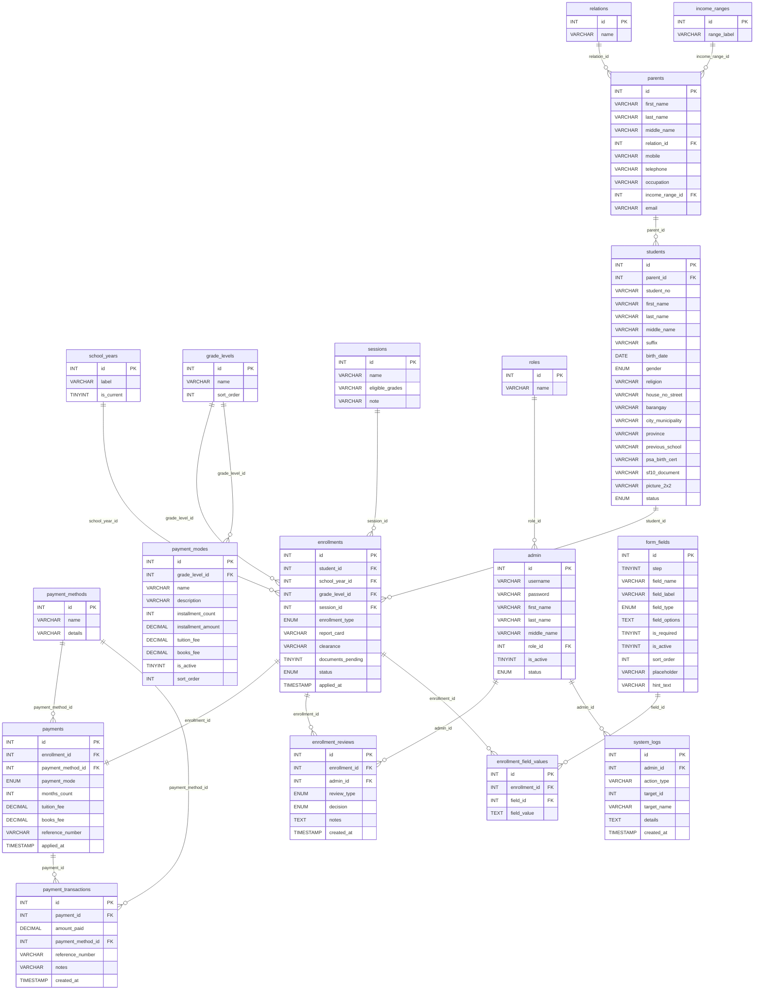

# Entity Relationship Diagram — `enrollment_db`

> [!NOTE]
> Generated from [schema_mysql.sql](file:///c:/xampp/htdocs/E-Assist/schema_mysql.sql). Diagram includes all **16 tables**, their columns, data types, and every foreign-key relationship.

---

## Full ER Diagram

---

## Relationship Summary

| Relationship | FK Column | Cardinality | ON DELETE |
|---|---|---|---|
| `relations` → `parents` | `relation_id` | one-to-many | RESTRICT |
| `income_ranges` → `parents` | `income_range_id` | one-to-many | RESTRICT |
| `parents` → `students` | `parent_id` | one-to-many | CASCADE |
| `students` → `enrollments` | `student_id` | one-to-many | CASCADE |
| `school_years` → `enrollments` | `school_year_id` | one-to-many | RESTRICT |
| `grade_levels` → `enrollments` | `grade_level_id` | one-to-many | RESTRICT |
| `sessions` → `enrollments` | `session_id` | one-to-many | RESTRICT |
| `enrollments` → `payments` | `enrollment_id` | one-to-one | CASCADE |
| `payment_methods` → `payments` | `payment_method_id` | one-to-many | RESTRICT |
| `payments` → `payment_transactions` | `payment_id` | one-to-many | CASCADE |
| `payment_methods` → `payment_transactions` | `payment_method_id` | one-to-many | RESTRICT |
| `enrollments` → `enrollment_reviews` | `enrollment_id` | one-to-many | CASCADE |
| `admin` → `enrollment_reviews` | `admin_id` | one-to-many | CASCADE |
| `admin` → `system_logs` | `admin_id` | one-to-many | CASCADE |
| `roles` → `admin` | `role_id` | one-to-many | RESTRICT |
| `grade_levels` → `payment_modes` | `grade_level_id` | one-to-many | CASCADE |
| `enrollments` → `enrollment_field_values` | `enrollment_id` | one-to-many | CASCADE |
| `form_fields` → `enrollment_field_values` | `field_id` | one-to-many | CASCADE |

---

## Table Groups

| Group | Tables |
|---|---|
| **Lookup / Config** | `school_years`, `grade_levels`, `relations`, `income_ranges`, `sessions`, `payment_methods`, `roles` |
| **People** | `parents`, `students`, `admin` |
| **Core Workflow** | `enrollments`, `enrollment_reviews` |
| **Payments** | `payments`, `payment_transactions`, `payment_modes` |
| **Dynamic Forms** | `form_fields`, `enrollment_field_values` |
| **Audit** | `system_logs` |
